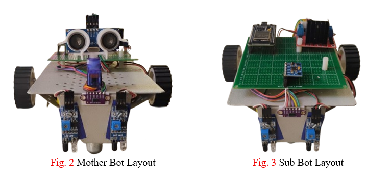
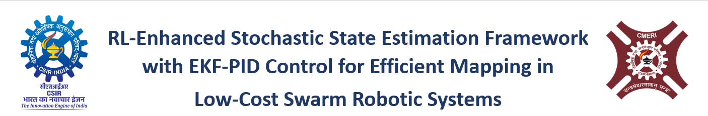

<p align="center">
  
</p>

<h1 align="center">
  
</h1>

# RL-Enhanced Stochastic State Estimation Framework with EKF-PID Control for Efficient Mapping in Low-Cost Swarm Robotic Systems

> **StochBots** — A hybrid RL + EKF + PID framework for autonomous, low-cost swarm robotics with real-time environmental mapping.

Developed as part of a B.Tech thesis at the **Department of Electrical Engineering, Institute of Engineering & Management, Kolkata** (MAKAUT, West Bengal), under the guidance of **Dr. R.K. Jain, Sr. Principal Scientist, Intelligent System Engineering Group, CSIR-CMERI**, and co-guided by **Prof. (Dr.) Deepro Sen**.

---

## Overview

Low-cost swarm robotic systems face significant challenges in achieving accurate localisation and efficient environmental mapping due to high sensor noise, actuator drift, nonlinear dynamics, and limited computational resources. **StochBots** addresses this by integrating Reinforcement Learning (RL) with an Extended Kalman Filter (EKF) and PID control — creating a unified, real-world deployable framework that adaptively tunes noise parameters in real-time.

The novelty lies in integrating RL with EKF to adaptively tune process noise (Q) and measurement noise (R) covariances in real-time, improving robustness and mapping accuracy without relying on expensive hardware like LiDAR or cameras.

---

## Key Results

| Method | RMSE (m) | Mapping Accuracy | Precision | Recall |
|--------|----------|-----------------|-----------|--------|
| Raw Sensor Data | 0.0640 | 58% | 0.62 | 0.70 |
| EKF | 0.0370 | 72% | 0.81 | 0.84 |
| **RL + EKF** | **~0.022** | **89%** | **0.90** | **0.93** |

- **~65–70% reduction in localisation error** over raw sensor data
- UDP communication latency: ~5.28 ms over 1000 cycles (0.00% packet loss)
- Sensor data streamed at 50 Hz meeting real-time constraints

---

## Features

- **Straight Line Motion (Yaw Stabilisation)** — IMU-based yaw estimation with PID correction for drift-free forward motion
- **Precise Degree Turns** — Gyroscope feedback + Kalman filtering for accurate, smooth rotational control
- **Fixed Distance Travel** — Odometry + PID regulation with ToF feedback to reduce cumulative distance error
- **Line Following** — Dual IR sensor-based path tracking with real-time motor adjustments
- **Obstacle Avoidance** — Ultrasonic sensing with directional scanning to choose the safest path
- **Localised Mapping** — Occupancy grid map built from ToF sensor data and sensor fusion
- **RL-Enhanced EKF** — Adaptive tuning of EKF covariances (Q & R) via reinforcement learning; avoids local maxima and handles non-Gaussian uncertainty
- **Web Control Interface** — Browser-accessible dashboard (AP mode) for real-time control, monitoring, and mapping

---

## System Architecture

```
Sensor Inputs (MPU6050 + ToF)
        │
        ▼
State Estimation (Kalman Filter — noise reduction & drift correction)
        │
        ▼
Grid Map Construction (Occupancy grid from ToF + odometry)
        │
        ▼
RL-Enhanced Optimisation (Adaptive EKF tuning: Q & R matrices)
        │
        ▼
Final Output: Stable trajectory control + accurate & refined mapping
```

The RL module runs on a host PC, receiving EKF states via UDP at 50 Hz and sending adaptive Q/R feedback to the robot for real-time optimisation. 2D occupancy grid visualisation is handled in Python/Processing.

---

## Hardware Components

| Component | Description |
|-----------|-------------|
| **Microcontroller** | ESP32 |
| **IMU** | MPU6050 — orientation, motion, gyro + accelerometer |
| **Distance Sensor** | VL53L0X Time-of-Flight (ToF) |
| **Motor Driver** | Dual DC motor control with PWM |
| **WiFi** | Built-in (AP mode) |

### IMU Calibration (Static Bias)

| Axis | Gyro Bias | Gyro Variance | Acc Bias | Acc Variance |
|------|-----------|---------------|----------|--------------|
| X | 103.2 | 4600 | 528 | 12000 |
| Y | 185.3 | 1800 | -1406.2 | 40000 |
| Z | -50.7 | 400 | 13341.4 | 60000 |

### Pin Configuration

```
Motor Pins:
  M1A:  GPIO 27    M1B:  GPIO 26
  M2A:  GPIO 25    M2B:  GPIO 33
  PWMA: GPIO 14    PWMB: GPIO 32
```

---

## WiFi & Web Interface

- **SSID**: `StochBot`
- **Password**: `12345678`
- **Mode**: Access Point (AP)
- **Dashboard URL**: `http://192.168.4.1`
- **WebSocket Port**: `81`

The robot creates its own WiFi network — no external infrastructure needed. Once connected, access the dashboard via any browser for real-time control, monitoring, and mapping.

---

## Project Structure

```
├── main.ino            # Setup and main control loop; PID parameters
├── motorcontrol.h      # Dual DC motor abstraction with PWM control
├── robotcontrol.h      # High-level motion primitives and autonomous behaviour
├── MPU.h               # MPU6050 driver — init, calibration, orientation tracking
├── KalmanFilter.h      # Kalman filter for sensor fusion & orientation estimation
├── PID.h               # PID controller for closed-loop speed/direction control
├── ToFSensor.h         # VL53L0X Time-of-Flight driver
├── ToFMap.h            # Occupancy grid mapping from ToF data
├── webhandler.h        # WebSocket/HTTP server for remote control
├── Interface.h         # Communication interface definitions
├── debugger.h          # Real-time diagnostics and logging
└── MapDrawer.h         # Python map visualisation integration
```

---

## Getting Started

### Prerequisites

- Arduino IDE with ESP32 board support
- Required libraries:
  - `Wire` (I2C)
  - `WebServer` (ESP32 built-in)
  - `WebSocketsServer`
  - `WiFi` (ESP32 built-in)

### Installation & Upload

1. Clone this repository
2. Open `main.ino` in Arduino IDE
3. Select the appropriate ESP32 board and COM port
4. Upload the sketch

### Running the System

1. Power on the robot
2. Connect your device to the `StochBot` WiFi network
3. Open `http://192.168.4.1` in a browser
4. Use the dashboard to command motion, monitor sensor data, and view the occupancy map
5. For RL-EKF operation: run the Python RL module on a host PC to receive UDP streams and send adaptive Q/R feedback

---

## Autonomous Modes

| Mode | Description |
|------|-------------|
| **Line Following** | Detects and follows a predefined dark line using IR sensors |
| **Obstacle Avoidance** | Detects obstacles and navigates around them using ToF/ultrasonic |
| **Localised Mapping** | Continuously scans the environment and builds a 2D occupancy grid |

---

## Dead-Reckoning Drift (Motivation for EKF)

Open-loop odometry was tested on a square trajectory (expected return to origin):
- Final position error: **(0.48 m, 0.12 m)** → closure error ≈ **0.495 m**
- Orientation drift: **~11°** heading deviation

This motivates the use of EKF-based state estimation integrated with RL for adaptive noise tuning.

---

## Performance Tuning

- **PID Parameters**: Defined in `main.ino` — default `(Kp=1.0, Ki=0.1, Kd=0.1)`. Tune based on observed performance.
- **Motor Calibration**: Run `motor.test()` to verify motor response.
- **Sensor Calibration**: MPU6050 calibrates automatically at startup.

---

## Troubleshooting

| Issue | Solution |
|-------|----------|
| MPU not detected | Check I2C connections; verify `Wire` library initialisation |
| ToF sensor issues | Confirm VL53L0X is connected via I2C |
| WiFi not connecting | Verify SSID (`StochBot`) and password (`12345678`) |
| Motor not responding | Check motor pin wiring and power supply |
| High mapping noise | Ensure IMU calibration ran at startup; check UDP packet loss |

---

## Future Scope

- Decentralised swarm intelligence (fully distributed coordination)
- Onboard RL deployment (edge AI on ESP32-S3)
- Advanced learning models (Deep RL, belief-space planning)
- Multi-modal sensor fusion (vision + LiDAR integration)
- Real-time diagnostics via Raspberry Pi 5

---

## Academic Context

This project was developed as a B.Tech thesis (2026) at IEM Kolkata under MAKAUT, West Bengal, in collaboration with **CSIR-CMERI, Durgapur** (Intelligent System Engineering Group).

**Thesis title**: *RL-Enhanced Stochastic State Estimation Framework with EKF-PID Control for Efficient Mapping in Low-Cost Swarm Robotic Systems*

**Author**: Vishal Roy (Roll: 12022002011065)
**Guide**: Dr. R.K. Jain, Sr. Principal Scientist, CSIR-CMERI
**Co-Guide**: Prof. (Dr.) Deepro Sen, IEM Kolkata

---

## License

This project is part of the SWARM robotics research initiative at CSIR-CMERI. Please contact the authors for usage permissions.
